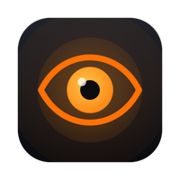
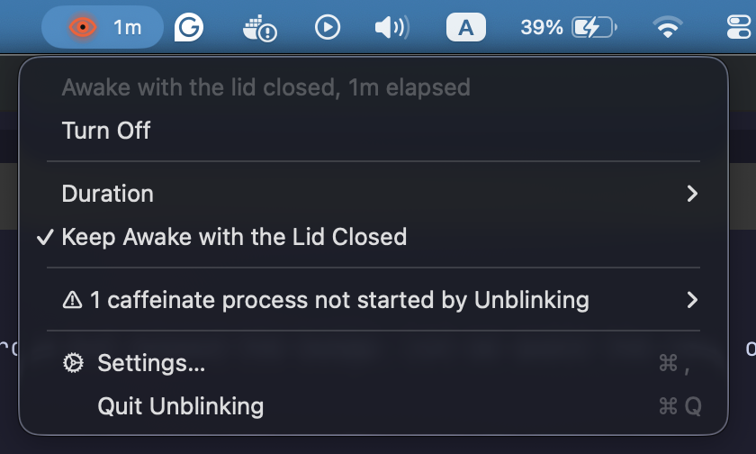
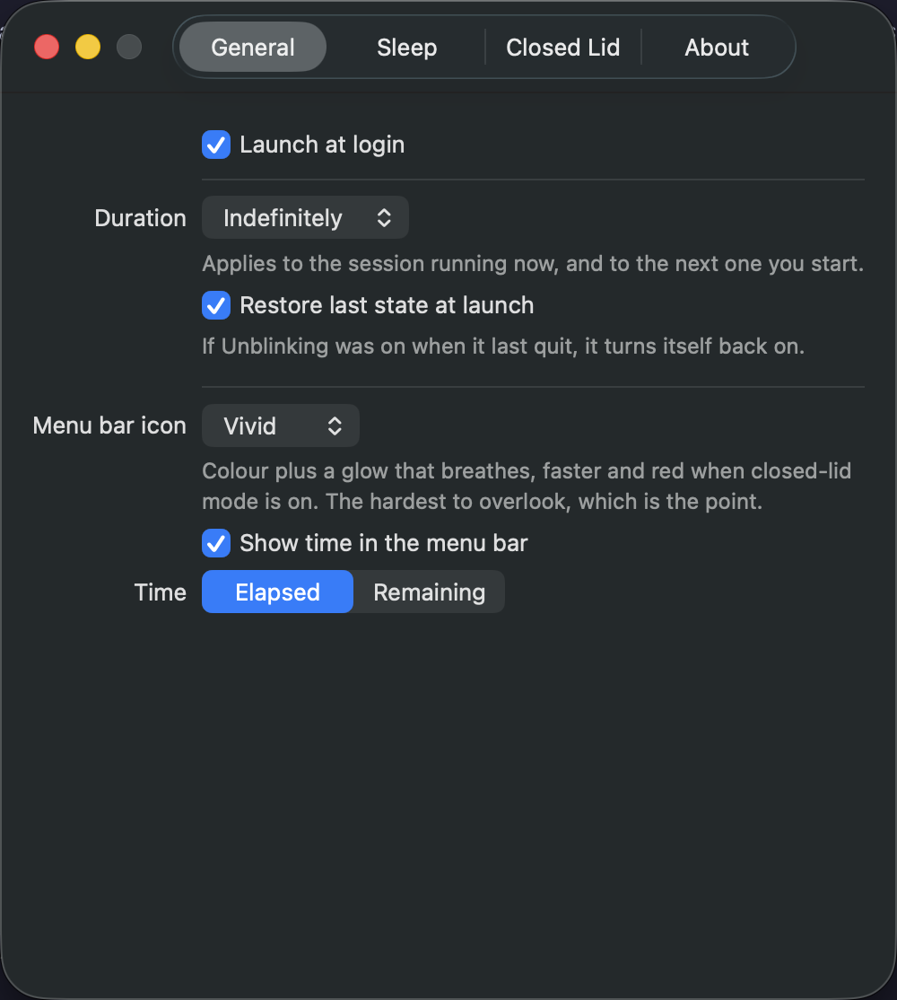
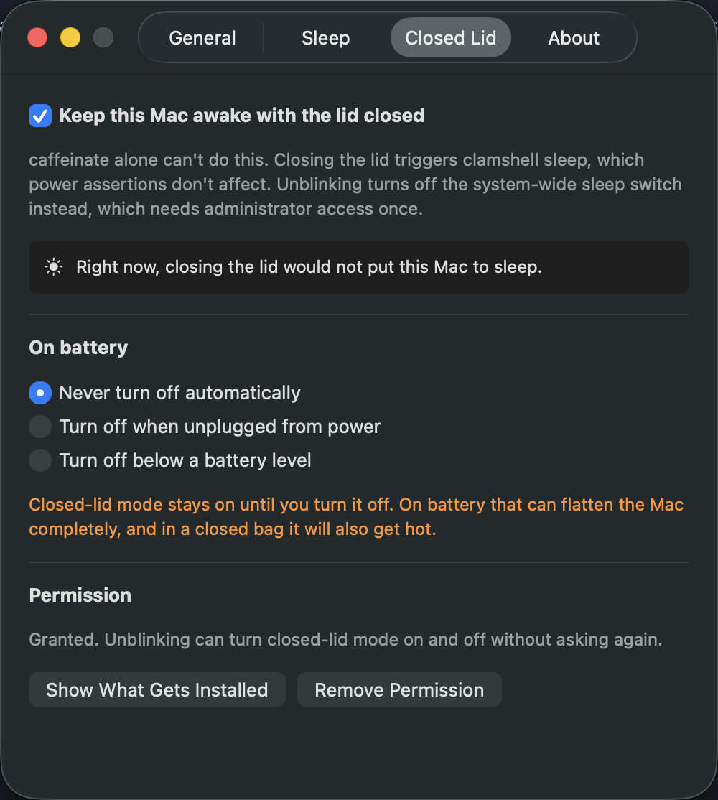

<div align="center">



# Unblinking

**Keep your Mac awake, including with the lid closed.**

The `caffeinate` command can't do that. This app can.

[](https://www.apple.com/macos/)
[](https://swift.org)
[](https://support.apple.com/en-us/HT211814)
[](LICENSE)
[](https://github.com/amr-ahmed-hamdy/unblinking/releases/latest)
[](#testing)



</div>

---

## Why this exists

If you've ever run `caffeinate` in a terminal, closed your MacBook, and come back to find
your job dead, this is why.

**`caffeinate` cannot keep a MacBook awake with the lid closed. It never could.**

`caffeinate` creates *power assertions*. Those block idle sleep, display sleep and disk
sleep, and that is all they can do. Closing the lid is a different mechanism entirely: the
lid sensor signals `IOPMrootDomain` and triggers **clamshell sleep**, a lower-level suspend
that power assertions never see. No combination of `-d -i -m -s -u` changes this. It's by
design, not a missing flag.

The only software override is the system-wide `SleepDisabled` flag, which needs root:

```bash
sudo pmset -a disablesleep 1
```

Unblinking wraps both mechanisms behind a single eye in your menu bar and, critically,
makes sure that flag always gets turned back off.

The second problem it solves is subtler: with `caffeinate` in a terminal, **nothing tells
you it's running.** You forget, and your Mac quietly never sleeps for three days. An eye
that is either shut or wide open removes that entire class of mistake.

---

## Features

| | |
|---|---|
| 👁 **One-click toggle** | Left-click the eye. That's it. |
| 💤 **Real closed-lid support** | Keeps working when you shut the lid, the thing `caffeinate` can't do |
| 🔆 **Impossible to miss** | A shut eye when off; an open, breathing eye when on |
| ⏱ **Timed sessions** | 15m / 30m / 1h / 2h / 4h / indefinitely, with a live countdown |
| 🔋 **Battery guards** | Never / turn off when unplugged / turn off below a threshold, applied the moment they become true |
| ⚠️ **Stray process detection** | Finds `caffeinate` started elsewhere and lets you stop it |
| 🔒 **Minimal privileges** | One admin prompt, ever, scoped to exactly two commands |
| 🧹 **Never leaves a mess** | Cleans up on quit, on crash, and on next launch |
| 🚀 **Launch at login** | Modern `SMAppService` registration |
| ♿ **Considerate** | Menu bar item is labelled for VoiceOver and reports its state; respects Reduce Motion |
| 🪶 **Tiny and native** | Pure Swift + AppKit. No dependencies, no Electron, no telemetry |

### The three states

| State | Icon | Meaning |
|---|---|---|
| **Off** |  | Eye shut. Normal sleep, and it blends into the menu bar |
| **Awake** |  | Eye open, orange, breathing slowly. Power assertions held |
| **Awake + lid** |  | Eye open and **red**, breathing at double speed. System sleep is disabled |

The states are deliberately lopsided. Off is a monochrome *template* image, so macOS tints
it like every other menu bar icon and it recedes. The active states are full colour with a
halo that breathes. Motion catches peripheral vision, which is exactly what you need when
you've forgotten it's running.

Urgency is carried by colour *and* tempo. Ordinary awake breathes orange over three
seconds; closed-lid mode breathes red in half that time, because it is the state that
disables system sleep outright and can flatten a battery in a closed bag.

The eye deliberately never blinks. A shut-eye frame is pixel-for-pixel the off state, so a
blinking icon would flash "asleep" every few seconds, precisely the confusion this app
exists to remove.

### Choosing how loud it is

Not everyone wants a glowing eye in their menu bar, so **Settings › General › Menu bar
icon** offers three levels. Each adds exactly one signal to the one before it:

| Style | Off | Awake | Lid closed |
|---|---|---|---|
| **Subtle** | shut eye | open eye | open eye + badge |
| **Colour** | shut eye | orange eye | red eye |
| **Vivid** *(default)* | shut eye | orange eye, breathing | red eye, breathing at 2× |

Subtle is a monochrome template image throughout, so macOS tints it exactly like every
other menu bar icon. Pick it if you want Unblinking to disappear into the bar. Vivid is
the default because the app exists to stop you forgetting.

**Reduce Motion overrides the choice.** If it's enabled in System Settings › Accessibility,
Vivid quietly falls back to Colour. That's an accessibility setting, not a preference, so it
wins.

---

## Installation

Requires **macOS 13 (Ventura) or later**. Apple Silicon and Intel both supported.

### Option A: download the release

1. Download `Unblinking.dmg` from [Releases](https://github.com/amr-ahmed-hamdy/unblinking/releases)
2. Open the DMG and drag **Unblinking** into **Applications**
3. Eject the DMG, then open **Unblinking** from Applications
4. An eye appears at the right-hand end of your menu bar. There is no Dock icon and no
   window. The menu bar is the whole app

> [!IMPORTANT]
> **Unblinking is not notarized**, so macOS will say it "cannot be opened because Apple
> cannot check it for malware." Notarization requires a paid Apple Developer Program
> membership; this is a free tool and doesn't have one.
>
> Two ways past it, once:
>
> **Terminal.** Fastest, and this is a terminal shaped audience:
>
> ```bash
> xattr -dr com.apple.quarantine /Applications/Unblinking.app
> ```
>
> **Or the GUI**: **System Settings › Privacy & Security**, scroll to Security, click
> **Open Anyway** next to the Unblinking message, then confirm. macOS 15 removed the old
> right-click → Open shortcut, so this is the only clickable route.
>
> What that flag actually is: macOS tags *downloaded* files with `com.apple.quarantine`,
> and Gatekeeper's dialog fires on that tag alone. Removing it is exactly what "Open
> Anyway" does. Apps you build yourself are never tagged, which is why **Option B below
> has no Gatekeeper step at all.**

### Option B: build it yourself (no Gatekeeper prompt)

Requires **Xcode 16 or later** (developed on Xcode 26.4 / macOS 26.2). Locally built apps
are never quarantined, so this path just works.

```bash
git clone https://github.com/amr-ahmed-hamdy/unblinking.git
cd unblinking
./Scripts/install-local.sh
```

That builds a Release copy, installs it to `/Applications`, and launches it. Or open
`Unblinking.xcodeproj` and press <kbd>⌘R</kbd>.

### First run

**Basic keep awake works immediately.** Click the eye and it goes orange. No permissions,
no setup.

**Closed-lid mode needs one administrator prompt.** Right-click the eye and tick
**Keep Awake with the Lid Closed**. macOS asks for your password once; after that it's silent
forever. See [Permissions](#permissions-exactly-what-gets-installed) for exactly what that
installs and how to remove it.

**To start it automatically**, open **Settings › General** and tick **Launch Unblinking at
login**. If macOS asks you to approve a background item, it appears under
**System Settings › General › Login Items & Extensions**.

---

## Usage

```
Left-click    →  toggle on/off instantly
Right-click   →  duration, closed-lid mode, warnings, settings
⌘,            →  settings
⌘Q            →  quit
```

Turning it on holds whichever assertions you've enabled in **Settings › Sleep**. Turning it
off releases everything immediately.

### Closed-lid mode

Enable **Keep Awake with the Lid Closed** (in the menu, or Settings › Closed Lid). The first
time you use it, macOS asks for your administrator password. After that it's silent.

Use it when you want to shut the lid and keep working: long builds, downloads, renders,
backups, a server on your desk, remote sessions you're SSH'd into.

> [!WARNING]
> With closed-lid mode on, your Mac **will not sleep**. On battery, in a closed bag, it will
> run until flat and get hot. The default battery policy is *Never turn off automatically*,
> the app warns you but respects your choice. Change it in Settings › Closed Lid if you'd
> rather it protected you.

### Battery policy

Closed-lid mode is the part that can flatten a battery, so it gets its own guard. Pick one in
**Settings › Closed Lid › On battery**:

| Option | On battery |
|---|---|
| **Never turn off automatically** (default) | Closed-lid mode holds at any charge, down to 1%. The app warns you and respects your choice. |
| **Turn off when unplugged from power** | Closed-lid mode is withdrawn the moment the charger comes out, and restored when you plug back in. Charge is irrelevant. |
| **Turn off below a battery level** | Closed-lid mode is withdrawn once the charge reaches your threshold, and restored if it climbs back above it. |

Two things worth knowing.

**Only closed-lid mode is withdrawn.** The session keeps running and your Mac stays awake
while the lid is open. The guard exists for the system-wide sleep flag, which is the part that
can run a machine flat in a closed bag. Plain `caffeinate` assertions cost nothing extra on
battery, so they are left alone.

**It applies the moment it becomes true**, not at the next power event. Switch to *Turn off
when unplugged* while already unplugged, or to *Turn off below a battery level* while already
under it, and closed-lid mode goes off straight away. Same for editing the threshold, in both
directions. You get a notification naming the condition that tripped, and the menu carries a
line for as long as it stays paused:

```
⚠ Closed-lid mode paused on battery (15%)
```

The threshold is a floor, so it is inclusive: at exactly 20% against a 20% threshold,
closed-lid mode is withdrawn. A Mac with no battery at all never has it withheld.

---

## Permissions: exactly what gets installed

Disabling lid-close sleep needs root. Rather than asking for your password every single
time, Unblinking asks **once** and installs a `sudoers` drop-in scoped to two exact
commands:

```sudoers
# /etc/sudoers.d/unblinking        (mode 0440, root:wheel)

<you> ALL=(root) NOPASSWD: /usr/bin/pmset -a disablesleep 0, /usr/bin/pmset -a disablesleep 1
```

That's the whole grant. No wildcards. Every other `pmset` subcommand, and every other
command on your system, still requires a password. There's a test that proves it:

```bash
sudo -n /usr/bin/pmset -a disablesleep 1   # allowed
sudo -n /usr/bin/pmset -g                  # refused
sudo -n /bin/ls /                          # refused
```

The rule is validated with `visudo -c` **before** it's installed, because a malformed
sudoers file can lock you out of `sudo` entirely.

**To remove it:** Settings › Closed Lid › **Remove Permission**, or:

```bash
sudo rm /etc/sudoers.d/unblinking
```

If you'd rather not grant this at all, just leave closed-lid mode off. Everything else in
the app works with zero privileges.

---

## Settings

<div align="center">


</div>

**General**: launch at login, default duration, restore state at launch, **menu bar icon
style**, and elapsed/remaining time in the menu bar.

**Sleep**: which assertions to hold: display (`-d`), idle system (`-i`), disk (`-m`),
system-while-on-power (`-s`).

**Closed Lid**: enable/disable, live "would closing the lid sleep this Mac?" status (polled
from the real `SleepDisabled` flag, so it stays honest even if something else changes it),
[battery policy](#battery-policy), and permission management (view the exact rule, or remove
it).

**About**: version and links.

---

## How it works

Two independent layers:

| Layer | Mechanism | Blocks | Privileges |
|---|---|---|---|
| **Assertions** | `caffeinate` subprocess | idle / display / disk sleep | none |
| **Clamshell** | `pmset -a disablesleep` | lid-close sleep | root, once |

### Never leaving your Mac awake by accident

`SleepDisabled` is system-wide and survives reboots, so every path that sets it has a path
that clears it:

- turning off, session timeout, Quit, logout, `SIGTERM`/`SIGINT`
- **at next launch**, the backstop for `kill -9`, a kernel panic or power loss. If the flag
  is still set, the app either clears it silently (its own breadcrumb says it was the owner)
  or asks you first (something else set it)

The `caffeinate` child is spawned as `caffeinate … -w <app pid>`, so it drops its assertions
and exits the moment the app does. **A crashed app cannot leave one running.**

### Stray processes

The menu reports `caffeinate` processes started outside the app and lets you stop them
individually. It never bulk kills, because plenty of tools spawn `caffeinate` legitimately (the
`claude` CLI runs `caffeinate -i -t 300`, for one), and silently killing someone else's
assertion would break their work.

### Project layout

| File | Responsibility |
|---|---|
| `UnblinkingApp.swift` | Entry point, accessory activation policy, signal handlers |
| `WakeCoordinator.swift` | State machine; owns both layers and all teardown paths |
| `CaffeineProcess.swift` | The `caffeinate` child, including the `-w` watchdog |
| `ClamshellController.swift` | Reads and writes the `SleepDisabled` flag |
| `PrivilegeBroker.swift` | sudoers rule: generate, validate, install, remove |
| `PowerEnvironment.swift` | Lid state, AC vs battery, charge level, power notifications. `PowerSourceReading` is the injectable seam the battery policies are tested through |
| `StatusItemController.swift` | Menu bar item, click routing, menu |
| `EyeIcon.swift` | Vector eye, template when off and full colour when active |
| `StrayProcessWatcher.swift` | Finds `caffeinate` running outside the app |
| `LoginItem.swift` | Launch at login via `SMAppService` |
| `SettingsView.swift` | Settings UI |

`PrivilegedRunner` is a protocol. The sudoers implementation is one conforming type, and an
`SMAppService` root daemon could replace it without touching call sites.

Built on `NSStatusItem` rather than SwiftUI's `MenuBarExtra`, because `MenuBarExtra` opens
its content on every click (making single-click-to-toggle impossible) and snapshots its
label rather than animating it.

---

## Four macOS traps this project hit

Documented because each one costs an afternoon:

**1. `sudoers.d` filenames cannot contain a dot.** sudo reads an `@includedir` directory but
*skips names containing `.` or ending in `~`*, so package managers can't break it with temp
files. A reverse-DNS name like `com.example.app` installs perfectly, looks correct in
`ls -l`, and is then silently never read.

**2. `sudo -n -l <command>` does not tell you whether a command is NOPASSWD.** Listing
privileges is itself subject to authentication, so it answers "a password is required" even
for a command that needs none. To test a grant, exercise it.

**3. `AppleClamshellCausesSleep` is not a forecast.** It reads like the perfect answer to
"will closing the lid sleep this Mac?" but doesn't vary with `SleepDisabled` at all while
the lid is open. It describes the *current* clamshell state, not a future one.

**4. `Process.waitUntilExit()` runs the calling thread's run loop.** So shelling out from the
main thread re-enters CoreFoundation and fires run loop observers, SwiftUI's update observer
among them, from inside an update already in progress. Reading `pmset` in a SwiftUI `body`
crashed the app outright:

```
waitUntilExit → _CFRunLoopRunSpecificWithOptions → __CFRunLoopDoObservers
  → __CFRUNLOOP_IS_CALLING_OUT_TO_AN_OBSERVER_CALLBACK_FUNCTION__
  → EXC_BAD_ACCESS (SIGSEGV) at 0x0
```

Waiting on a semaphore signalled from `terminationHandler` never touches the run loop, so it
cannot re-enter. Views poll from a `.task` rather than shelling out while rendering.

---

## Testing

91 tests, run against the real system rather than mocks: real `caffeinate` processes, real
`pmset` output, real signals.

```bash
xcodebuild -scheme Unblinking test

# include tests that need an admin prompt
UNBLINKING_PRIVILEGED_TESTS=1 xcodebuild -scheme Unblinking test
```

Notable coverage: the assertion actually appearing in `pmset -g assertions` matched by pid;
no orphan surviving `kill -9`; `caffeinate -w` verified against the real binary; the
generated sudoers rule handed to real `visudo`; and the grant refusing every command outside
its two.

The battery policies are the exception to "real system, not mocks", and deliberately so. They
are decided entirely by charge and power source, and neither can be staged on real hardware:
a test machine is plugged in or it is not, and its charge is whatever it happens to be. So
`PowerSourceReading` is injected, which lets the suite cover every policy at every boundary,
including a sweep of all 18 threshold values against all 101 charge levels, plus switching
into a policy while already in its triggering condition, unplugging mid-session, and plugging
back in.

### Verifying it yourself

```bash
pmset -g assertions | grep caffeinate   # assertion held while on
pmset -g live | grep SleepDisabled      # 1 while closed-lid mode is on
sudo -l                                 # the grant is only those two commands
```

The end to end test nothing substitutes for:

```bash
./Scripts/lidtest.sh            # start, then close the lid
./Scripts/lidtest.sh --report   # after you reopen
```

It records a heartbeat every 30 seconds alongside battery, power source and thermal state,
so a long run can be checked for gaps and for the things a short run cannot surface: drain,
throttling, or macOS sleeping anyway after some delay. Plug in first. An unattended closed
laptop on battery is how you flatten one.

Run it once with closed-lid mode **on** and once with it **off**. Without that second run,
an absent gap could just mean the machine never tried to sleep, so the negative control is
what makes the result mean anything.

Cross-check any gap against `pmset -g log`. The kernel records
`Entering Sleep state due to 'Clamshell Sleep'` with a timestamp, so you can confirm a gap
is genuine sleep rather than a stalled shell.

Verified on a MacBook Air (M1), macOS 26.2: with closed-lid mode off the machine slept the
moment the lid shut and the kernel logged it. With closed-lid mode on it kept running and
logged no sleep at all. A longer endurance run is under way and the figure will be
published here once it finishes.

---

## Releasing

```bash
DEVELOPMENT_TEAM=YOURTEAMID ./Scripts/release.sh
```

Archives, signs with Developer ID, notarizes, staples, and produces both a zip and a DMG
that anyone can double-click with no Gatekeeper warning. Notarization credential setup is in
the script header.

---

## Contributing

Contributions are genuinely welcome. This is a small, focused codebase that's easy to get
into.

1. Fork the repo and create a branch: `git checkout -b feature/your-idea`
2. Make your change. Match the surrounding style; the code favours plain, explicit Swift
3. Add a test. Anything touching sleep behaviour or privileges **must** have one
4. Run `xcodebuild -scheme Unblinking test` and make sure it's green
5. Open a PR describing what changed and why

**Ideas worth picking up:**

- [ ] A global hotkey to toggle without reaching for the mouse
- [ ] `SMAppService` privileged daemon as an alternative to the sudoers drop-in
- [ ] Auto-enable on specific apps running (builds, renders, downloads)
- [ ] Scheduled sessions ("stay awake until 6pm")
- [ ] Localisation
- [ ] Homebrew cask

Found a bug? [Open an issue](https://github.com/amr-ahmed-hamdy/unblinking/issues) with your macOS
version, your Mac model, and what you expected.

---

## Support this project

If Unblinking saved you from a dead build or a flat battery:

⭐ **[Star the repo](https://github.com/amr-ahmed-hamdy/unblinking)**, the single most useful thing
you can do. It's how other people find it.

🔧 **Contribute**: pick something from the list above, or bring your own idea. PRs get
reviewed properly.

🐛 **[Report a bug](https://github.com/amr-ahmed-hamdy/unblinking/issues)**, especially anything
involving sleep behaviour on hardware I can't test.

🗣 **Tell someone.** If you know a developer who's lost a job to a closed lid, they'll want
this.

---

## Author

**Amr Ahmed Hamdy**, Senior Software Engineer, AI Driven Development

[](https://www.linkedin.com/in/amr-hamdy/)

---

## License

[MIT](LICENSE) © 2026 Amr Ahmed Hamdy

Use it, fork it, ship it. Attribution appreciated but not required.
